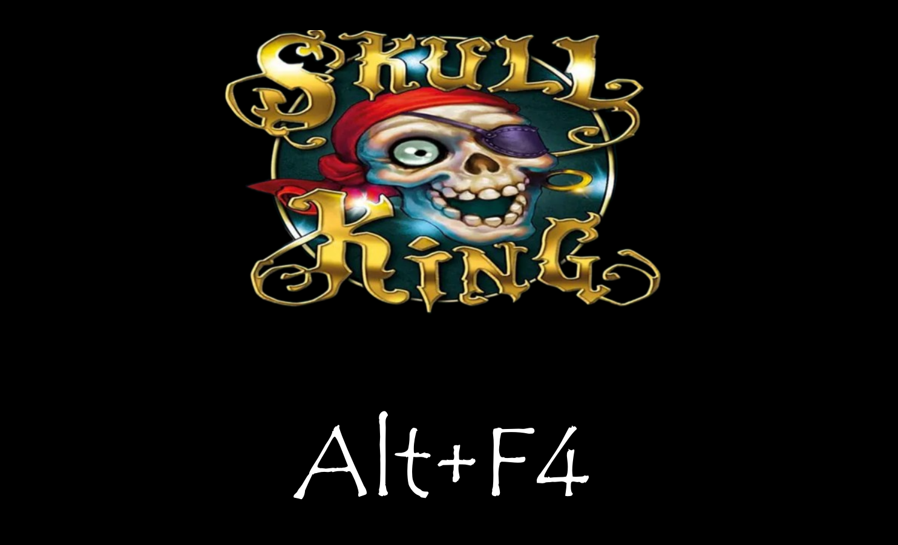
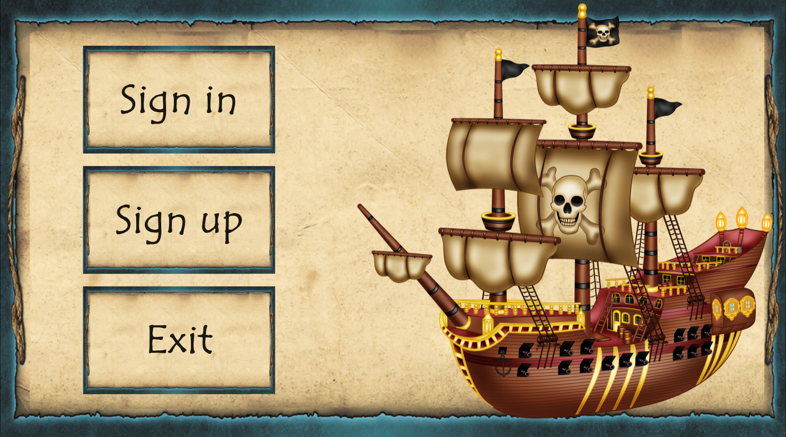
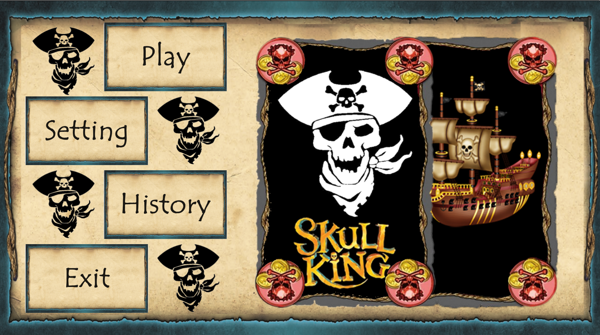
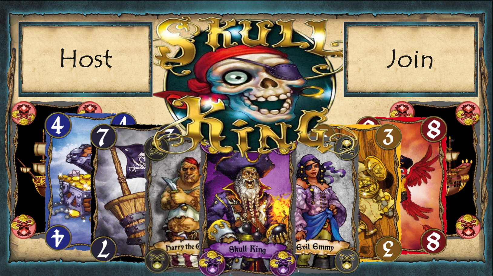
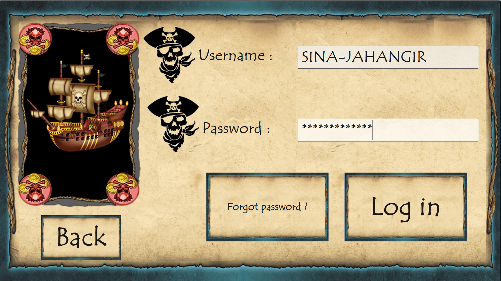
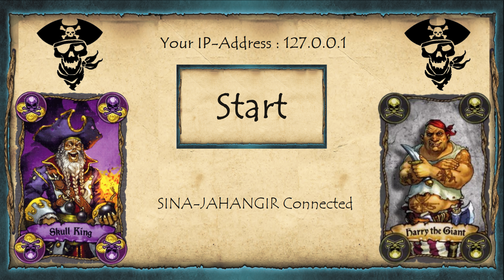
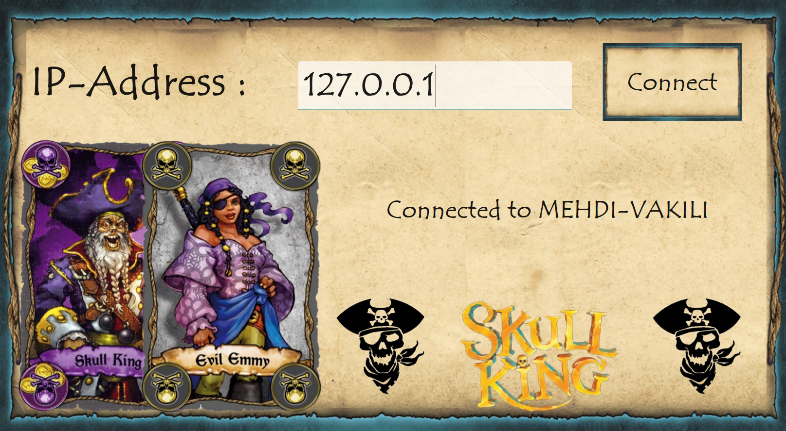
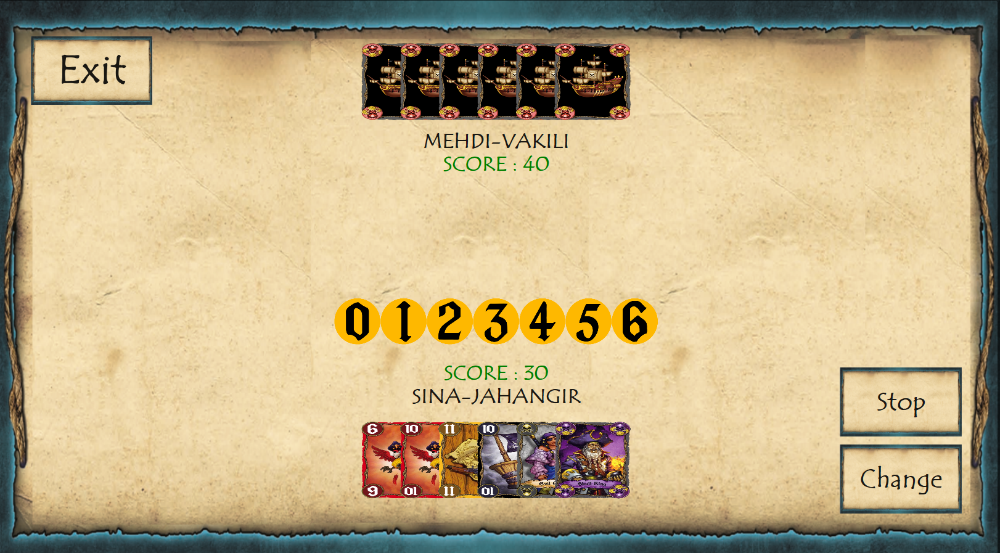
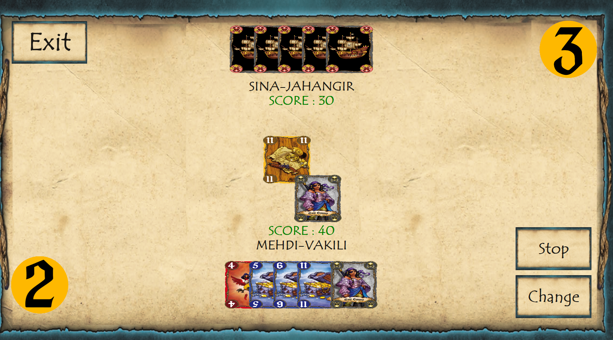

# Skull King

## Table of Contents
- [Overview](#overview)
- [Features](#features)
- [Installation & Setup](#installation-&-setup)
- [How to Play](#how-to-play)

## 🎯 Overview
**Skull King** is an engaging two-player card game inspired by the classic **Skull King**. This project was developed using **C++** and the **Qt framework** as a final project for an Advanced Programming (AP) course. Created in collaboration with my teammate under the team name **Alt+F4**, we have implemented a variety of enhancements that enrich the gameplay experience while preserving the fundamental mechanics of the original game.

## 🛠️ Features

- **Pause Functionality:** Each player can pause the game for up to 30 seconds, with a limit of two pauses per game.
- **Automatic Card Play:** If a player does not choose a card within a specified time frame, the game will automatically play a card for them. This feature ensures that the game flows smoothly and keeps the action moving.
- **Earning and Losing Coins:** Players can earn coins by winning the overall game while losing coins if they do not succeed.
- **Beautiful Graphics and Music:** Enjoy visually stunning graphics accompanied by immersive game music that enhances the overall experience.


### ✨ Special Feature: Card Exchange

- **Card Exchange Mechanism:** During the game, players can initiate an exchange request. If accepted by the opposing player, one card from each player's hand will be randomly exchanged. This feature adds a strategic element to the gameplay, allowing for unexpected turns and tactical decisions.

## 🚀 Installation & Setup
Get up and running with **Skull King** in a few simple steps:

1. **Clone the repository**:
   ```bash
   git clone https://github.com/SINA-JAHANGIR/Skull-King.git
   ```

2. **Install dependencies**:
   Make sure you have the following:
   - **Qt Framework 6.5.1+** installed on your system.
   - A **C++ compiler**.

3. **Build the game**:
   Open the project in **Qt Creator**, configure it with **CMake**, and build the game.

4. **Run the game**:
   You can now run **Skull King** directly within **Qt Creator** or generate an executable to play on your Windows machine.

## 🎮 How to Play

1. **Bidding Phase:** Each player starts by bidding how many tricks they think they can win for the round.
2. **Playing Phase:** Players take turns playing cards. The goal is to win as many tricks as predicted during bidding.
3. **Scoring Phase:** At the end of each round, points are awarded based on the accuracy of the bids. Missing the bid results in point penalties!
4. **Victory:** The player with the most points after 7 rounds is the winner.

I hope you enjoy this game:)










